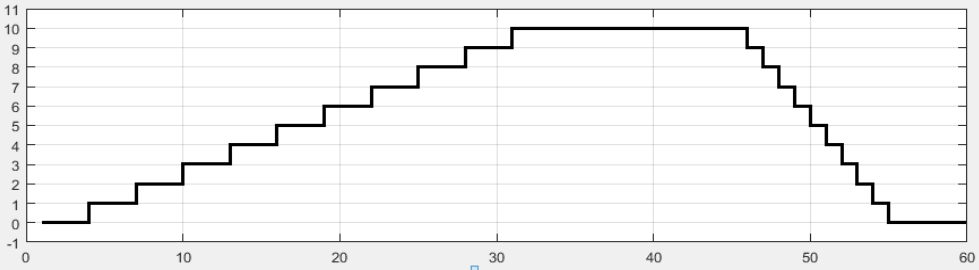
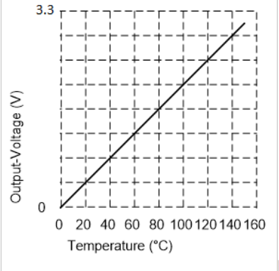
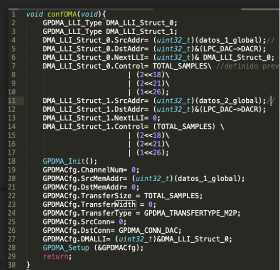

# Parcial 2018
## Ejercicio largo
Utilizando CMSIS escriba y comente un código que genere una onda del tipo trapezoidal a la salida del DAC como se muestra en la figura. Para ello el DAC comenzará, a partir de cero, a incrementar su valor de a un bits hasta llegar a un valor máximo que se mantendrá un tiempo dado y luego decrementará de a un bits hasta volver a cero nuevamente. Los controles del valor máximo y los tiempos de duración de los escalones de subida y bajada están organizados en la posición de memoria 0x10004000 de la siguiente forma:
bits 0 a 7: valor máximo a alcanzar por el DAC.
bits 8 a 15: valor a utilizar en una función de demora que define el tiempo que se mantiene el valor máximo.
bits 16 a 23: valor a utilizar en una función de demora para definir el tiempo que se mantiene cada incremento de 1 bits en la subida.
bits 24 a 31: valor a utilizar en una función de demora para definir el tiempo que se mantiene cada decremento de 1 bits en bajada.

## Ejercicio corto
Considerando que se tiene un bloque de datos comprendidos entre las posiciones de memorias, dirección inicial= 0x10000800 a la dirección final= 0x10001000 ambas inclusive y se desea trasladar este bloque  de datos una nueva zona de memoria comprendida entre la dirección inicial= 0x10002800 y la dirección Final=0x10003000 (en el mismo orden). Teniendo en cuenta además que los datos contenidos dentro de la zona de  memoria son de 16 bits (AHB Master endianness configuration - por defecto) y que estos deben moverse de a uno (1)  en cada evento de DMA, se sincronizará la transmisión con evento de match0 del timer1.
Se pide que Enumere y explique los puntos a tener en cuenta para configurar correctamente el controlador DMA

## Ejercicio tipo
Considere la región de memoria a partir de la dirección 0x10003000, de 2048 datos de tipo entero de 16 bits, sin signo. Estos son datos provenientes de 4 canales del ADC, siendo el primero del canal 0, el segundo del canal 1, el tercero del canal 2 y el cuarto del canal 3, el quinto del canal 0 y así sucesivamente, estos datos están guardados en binario natural, tal como los entrega el ADC. Realice un algoritmo que calcule el promedio total de cada uno de los canales y guarde el valor del promedio de cada canal en un arreglo de 4 elementos.
Suponiendo que los valores de tensión corresponden a un sensor de temperatura cuya curva se puede ver en la siguiente gráfica. Calcule la resolución en temperatura (valor del escalón mínimo de temperatura que puede distinguirse con un conversor A/D de 12 bits)

# 2do parcial del 2022
## Ej1
Programar el microcontrolador LPC1769 para que mediante su ADC digitalice  dos señales analógicas cuyos anchos de bandas son de 10 Khz cada una. Los canales utilizados deben ser el 2 y el 4 y los datos deben ser guardados en dos regiones de memorias distintas que permitan contar con los últimos 20 datos de cada canal. Suponer una frecuencia de core cclk de 100 Mhz. El código debe estar debidamente comentado.

## Ej2
Utilizando el timer0, un dac, interrupciones y el driver del LPC1769 , escribir un código que permita generar una señal triangular periódica simétrica, que tenga el mínimo periodo posible, la máxima excursión de voltaje pico a pico posible y el mínimo incremento de señal posible por el dac. Suponer una frecuencia de core cclk de 100 Mhz. El código debe estar debidamente comentado.

## Ej 3
En la siguiente sección de código se realiza la configuración de un canal de DMA
a - Explique detalladamente cómo queda configurado el canal, que tipo de transferencia está realizando.
b - ¿Qué datos se transfieren, de qué posición a cuál y cuántas veces?
c- ¿Cómo se define el tiempo de "Interrup DMA request"  o el tiempo de transferencia de c/dato? 

